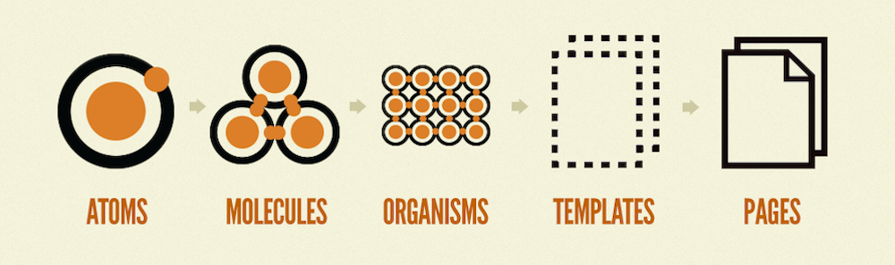

The first step in creating a new component library is identifying which components to build. With each team and codebase being unique there isn't a hard rule on what should or shouldn't be shared. But, there are techniques that can help you identify components that maximize developer productivity while still being flexible enough for a variety of scenarios.

In this lesson we will take a look at the concept of [Atomic Design](https://bradfrost.com/blog/post/atomic-web-design/) and learn how it can be used by library authors to identify shareable components.

## Atomic Design

[Atomic Design](https://bradfrost.com/blog/post/atomic-web-design/) is a design methodology created by Brad Frost. Originally created to promote consistency and scalability within design systems, it is a useful tool for identifying shared components in existing codebases.

In Atomic Design, user experiences can be broken into five distinct levels:

1. Atoms
1. Molecules
1. Organisms
1. Templates
1. Pages

_Image by [Brad Frost (Atomic Design)](https://bradfrost.com/blog/post/atomic-web-design/)_

### Atoms

Atoms are the building blocks of matter. In the context of a component library, atoms can include standalone HTML elements as well as more abstract concepts like colors, typography, and spacing.

Atoms are flexible, but they're often too abstract to provide a consistent user experience. Utility-first CSS frameworks, like [TailwindCSS](https://tailwindcss.com/), could be a useful implementation for this concept.

### Molecules (most useful)

Molecules are composed of smaller atoms. They can combine atomic styles like color and spacing with more complex concepts like accessibility, layout, and internal state. Some examples of molecules include: buttons, inputs, radios, tabs, drop-downs, tooltips, and most other self-contained UI widgets.

**Molecules are the most common type of shared component.** They provide a consistent user experience while still being flexible enough for most implementations.

### Organisms, Templates, and Pages

Organisms, templates, and pages continue to build on each other to provide more complex experiences. These concepts work well for design systems, but often include business logic and other complexity that limits the flexibility of our component library. We will not be focusing on these component types in this course.
