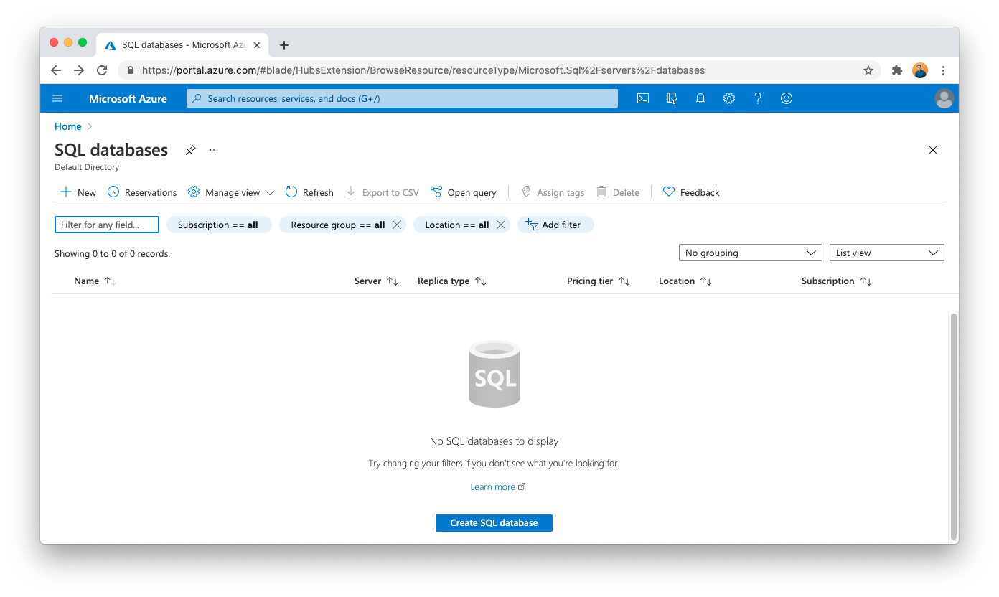
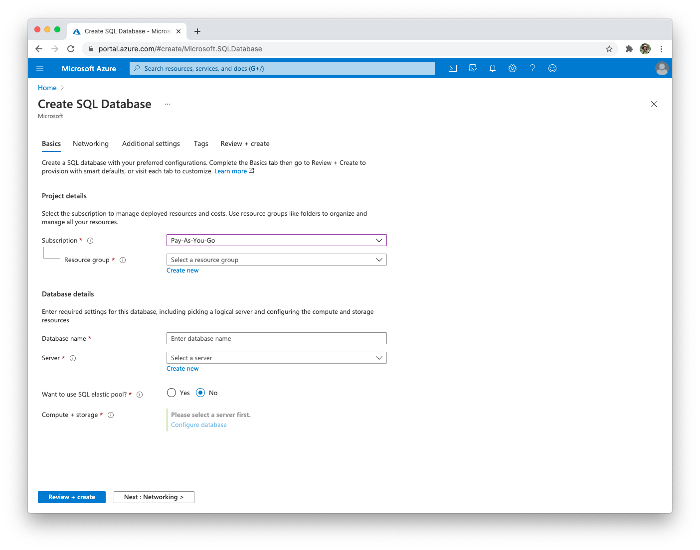
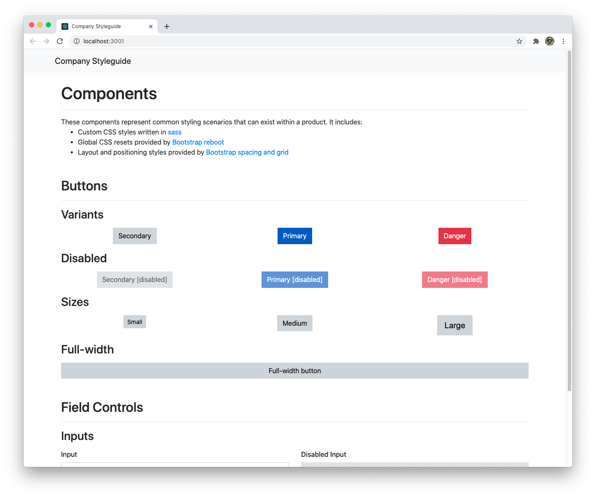

Using the concepts from the previous lesson, it's possible to find shared components in even the most complex codebases. Let's walk through an advanced UI example and identify the different elements of Atomic Design:

1. Atoms
1. Molecules
1. Organisms
1. Templates
1. Pages

Here is a UX example from the Azure SQL database portal:




Using Atomic Design we can identify:

- Atoms
  - Shared color palette
  - Font and typography
  - Consistent spacing values
  - Icons
- Molecules
  - Icon buttons
  - Tabs
  - Removable pills
  - Select and autocomplete components
  - Radio inputs
  - Buttons
- Organisms
  - Common header layout
  - Interactive table
  - Side-by-side pairing of labels and form inputs
- Templates
  - The page layout which includes a header, title, description, breadcrumbs, content, and footer
- Pages
  - The individual list and add pages

The elements listed as molecules would make shared components that are flexible enough to be used in a wide variety of scenarios.

## Demo codebase

Our demo codebase is a showcase for components that are used in common application experiences. It includes custom styling built with [SASS](https://sass-lang.com/) that we will be migrating to our shared component library. The components we will implement include:

- Button
- Input
- Textarea

It is built using [create-react-app](https://reactjs.org/docs/create-a-new-react-app.html), [TypeScript](https://www.typescriptlang.org/), and [Sass](https://sass-lang.com/). We will use this example codebase to help identify what styling and features we need to include in our component library.

Download the full course code [by clicking here](https://api.newline.co/assets/protected/courses/newline-guide-to-building-a-company-component-library/downloads/course-full.zip). Unzip the contents and the internal `code.zip` and run the following commands:

```bash
cd course-full/code/demo-styleguide

# Install dependencies and start the application
npm install
npm start
```

With the demo codebase running we can see the components that we will be building.



## Global vs component styling

Not all page styling should be abstracted into shared components. To be as flexible as possible, components should avoid any styling that:

- Applies margin or other positioning constraints
- Overrides nested content styling
- Enforces layout

Some examples of component styling in the demo are:

- Internal padding for buttons
- Component color and disabled/hover/focus states
- Style variants like the full-width button

The example also includes some global styling that we will be avoiding in this course:

- Flexible positioning grid
- External margin applied to components
- Global typography elements
- Header styling

Global styling isn't necessarily a bad thing to include in a component library, but it can cause issues with flexibility and reuse later on.

## Open-source component libraries

There are many open-source component libraries that you can use for component inspiration:

- [material-ui](https://material-ui.com/)
- [Shopify Polaris](https://polaris.shopify.com/)
- [Ant Design](https://ant.design/)
- [Zendesk Garden](https://garden.zendesk.com/)
