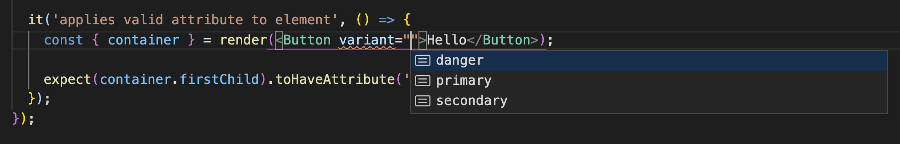

When creating any shared asset the technologies that you choose will affect your consumers. This is especially true with front-end shared assets, including component libraries.

In this course we will be choosing dependencies that allow our component library to be used in a wide variety of React codebases.

## Types of dependencies

NPM packages have [three types of dependencies](https://docs.npmjs.com/specifying-dependencies-and-devdependencies-in-a-package-json-file):

- `dependencies`
  - Packages required by your application in production
  - These are installed with your package
- `devDependencies`
  - Packages that are only needed for local development and testing
  - When your component library is installed, these packages _are not_ included
- `peerDependencies`
  - Packages that consuming codebases are required to install
  - Useful for dependencies that require a single instance, i.e. `react` and `react-dom`

```json
// Example React library package.json

{
  "dependencies": {
    "lodash.throttle": "^4.1.1" // Required to run in production
  },
  "peerDependencies": {
    "react": ">=16.12.0", // Must be provided by consuming codebases
    "react-dom": ">=16.12.0" // Any version above 16.12.0
  },
  "devDependencies": {
    "eslint": "^7.19.0", // Only required for local development
    "react": "^17.0.1", // Local development version
    "react-dom": "^17.0.1", // Within valid peerDependency range
  },
}
```

## Component styling and styled-components

Front-end applications style their content using a variety of technologies. Sass, Less, and PostCSS are just a handful of the popular solutions available that produce static CSS.

Component libraries can also use these same technologies, but providing static CSS for consumers can create complicated styling scenarios. Common problems include:

- Style specificity
  - Ensuring that the component styles don't affect the consuming application's styles.
  - [CSS Modules](https://github.com/css-modules/css-modules) are a potential solution for this issue.
- Asset management
  - Providing non-JavaScript assets may require consumers to customize their build configurations.
- Bundle size
  - With CSS you often have to include a single file with all required styling. This negates some of the size savings resulting from tree-shaking.

For component libraries, CSS-in-JS is a common solution to these problems. It allows us to create our styles in the same way that we develop our React Components.

In this course we will be using [styled-components](https://styled-components.com/) as our CSS-in-JS library. If your organization uses a different library, like [Emotion](https://emotion.sh/docs/introduction), these same concepts will apply.

## TypeScript

[TypeScript](https://www.typescriptlang.org/) is a typed superset of JavaScript that helps find errors at build time. It's not only a benefit to us as library authors, but can also help document components for TypeScript and JavaScript consumers.

If developers are using VS Code or another TypeScript-aware editor, they will have autocompletion and prop descriptions even if they're only using JavaScript.


