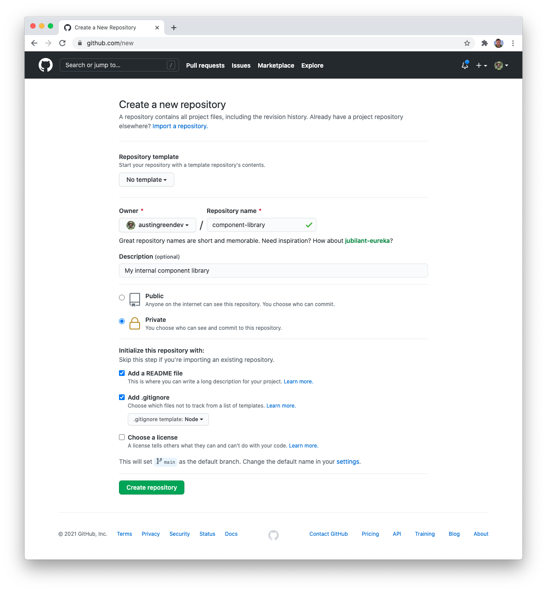
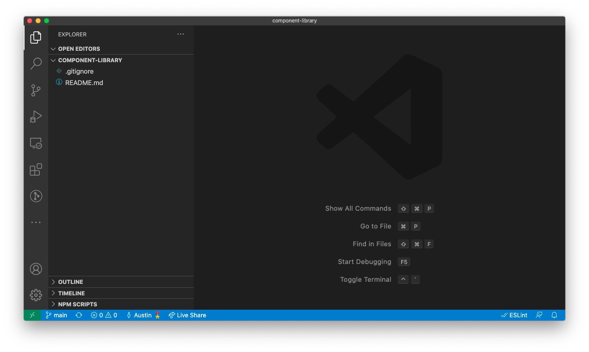

## Create GitHub repository

GitHub has a [generous free plan](https://github.com/pricing) which allows us to create private repositories, run a CI/CD environment, and host private NPM packages. The first step for our new component library is to [create a private GitHub repository](https://github.com/new).



Repository details:

- **Owner**
  - Use your GitHub username
  - If your company uses GitHub you may create this package under their organization when creating a component library for production
- **Name**
  - Use `component-library`
- **Permissions**
  - Make sure the repository is listed as `PRIVATE`
- **README / .gitignore**
  - Provide a default `README` as well as the `Node .gitignore` template

## Clone repository

Once the repository is created, let's clone it to our machine.

```bash
# Navigate to where you want to store the repository
cd ~/Courses

# Use the HTTPS or SSH values provided by GitHub
git clone COPY_FROM_GITHUB
```

When the repository is finished cloning, open it in your editor of choice. You should see the `README` and `.gitignore` we defined in the previous step.



## Initialize the package

To help the initial package creation we will use the [npm-init](https://docs.npmjs.com/cli/v7/commands/npm-init) command.

```bash
# Navigate to our component library
cd ~/Courses/component-library

# Initialize our package with all default values
npm init --force
```

You will see a new `package.json` with its values pre-populated to match our repository. Let's update the name of the package to include our GitHub account as a scope:

```json
// File: package.json

{
  "name": "@GITHUBUSERNAME/component-library",
  "version": "0.0.0"
}
```

## Dependencies

The first dependencies we will add are the React-based `peerDependencies`. Use the following command to add them to our `package.json`:

```bash
npm install --save-peer react react-dom
```

The command above adds the dependencies with a open semver range. To allow for a wider range of React versions to consume this library, let's manually change the version ranges:

```json
{
  "peerDependencies": {
    "react": ">=16.12.0",
    "react-dom": ">=16.12.0"
  }
}
```

These minimum version ranges are determined from what React features you require for the components to run. We will be using Hooks within our components. `v16.12.0` is a good starting point for those features.

## TypeScript

Next, let's add TypeScript to our library. We also need to include the necessary type declarations for `react` and `react-dom`. These packages are stored as `devDependencies` as they are only
required for local development.

```bash
# Temporary until Storybook fully supports TypeScript ^4.3.X
npm install --save-dev --save-exact typescript@4.2.2
npm install --save-dev @types/react @types/react-dom
```

To help TypeScript understand our React environment, we have to create a local `tsconfig.json` file. This configuration doesn't emit any JavaScript when the TypeScript compiler is ran. Its only
purpose is to assist with type-checking.

```json
/* File: tsconfig.json */
{
  "compilerOptions": {
    "target": "ESNext",
    "lib": ["dom", "dom.iterable", "esnext"],
    "allowJs": true,
    "skipLibCheck": true,
    "esModuleInterop": true,
    "allowSyntheticDefaultImports": true,
    "strict": true,
    "forceConsistentCasingInFileNames": true,
    "noFallthroughCasesInSwitch": true,
    "module": "esnext",
    "moduleResolution": "node",
    "resolveJsonModule": true,
    "isolatedModules": true,
    "noEmit": true,
    "jsx": "react-jsx"
  },
  "include": ["src/**/*"]
}
```

## First component

Now that we have the basics added, let's create our first React component. To start we will be creating a simple `Button` component.

First, let's create a new `src` directory for our components and add an empty `buttons/Button.tsx` file.

```bash
mkdir -p src/buttons
```

Once created, populate the new file with this simple `Button` implementation.

```tsx
// File: src/buttons/Button.tsx

import React from "react";

export const Button = () => {
  return <button>Hello world</button>;
};
```

To ensure that TypeScript is configured correctly, run the compiler and ensure no errors are listed.

```bash
# Run the TypeScript compiler
npx tsc
```

## Commit changes

Save our progress by creating a new commit.

```bash
git add -A
git commit -m "Initialize new package"
```

## Next lesson

In the next lesson we will be creating a Storybook environment to help document and develop our components.
