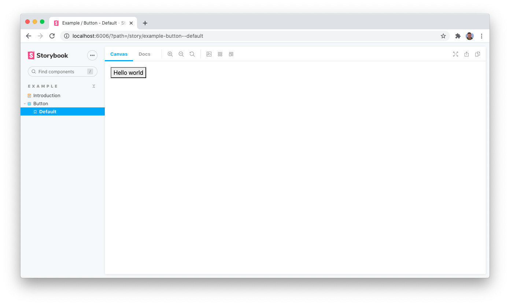

While developing our library we need the ability to build, test, and document our components in isolation. [Storybook](https://storybook.js.org/) is a tool that allows us to develop our components locally while
mimicking a product environment.

In this lesson we will be creating a new Storybook environment in our codebase where we can can document and visually test our components.

## Initialize Storybook

To add Storybook to our library we can use the `Storybook CLI`. The CLI will look at our dependencies and create a default Storybook configuration for a React and TypeScript codebase.

```bash
npx sb init
```

This command will create and modify several files:

- `.storybook`
  - `main.js` (main configuration file)
  - `preview.js` (customize the presentation of components)
- `src/stories`
  - `*.stories.tsx` (component documentation follows this naming convention)
- `package.json`
  - Storybook dependencies are added
  - `storybook` and `build-storybook` NPM scripts are added

Run the `storybook` command to view the newly created Storybook environment:

```bash
npm run storybook
```


## Story creation

The initialization process creates several demo components and stories. We need to update these to reference our existing `Button` component.

First, remove all of the example stories created during the initialization process.

```bash
rm -rf src/stories/*
```

Next, we will create a new `Introduction.stories.mdx` file which will include the content of our libraries `README.md` file.

```md
<!-- File: src/stories/Introduction.stories.mdx -->

import { Meta, Description } from '@storybook/addon-docs/blocks';
import README from '../../README.md';

<Meta title="Example/Introduction" />

<Description>{README}</Description>
```

[MDX](https://storybook.js.org/docs/react/writing-docs/mdx#gatsby-focus-wrapper) files allow us to combine Markdown with JSX.

To document our `Button` component we need to create a `Button.stories.tsx` file.

```tsx
// File: src/stories/Button.stories.tsx

import React from "react";
import { Story, Meta } from "@storybook/react/types-6-0";
import { Button } from "../buttons/Button";

export default {
  title: "Example/Button",
  component: Button,
} as Meta;

const Template: Story = (args) => <Button {...args} />;

export const Default = Template.bind({});
```

## Preview customization

The components documented in Storybook are rendered within an iframe. This is helpful for testing components in isolation, but may not be an accurate representation of the environment that will be consuming the component.

In our `demo-styleguide` example, the components are styled with custom SASS styles. But, the environment those styles are used in includes [global Bootstrap styling](https://getbootstrap.com/docs/5.0/content/reboot/). These CSS resets affect how our component will be rendered so we need to ensure our Storybook environment includes these styles.

To align our Storybook environment with our consuming codebase we must add the `bootstrap` dependency and include it within the `.storybook/preview.js` file.

```bash
npm install --save-dev bootstrap
```

```js
// File: .storybook/preview.js

import "bootstrap/dist/css/bootstrap.min.css";

export const parameters = {
  actions: { argTypesRegex: "^on[A-Z].*" },
}
```



## Popular addons

Another benefit of documenting components with Storybook is their [rich addon ecosystem](https://storybook.js.org/addons). You are able to extend and customize your Storybook instance with first-party and third-party addons:

- **[Accessibility:](https://storybook.js.org/addons/@storybook/addon-a11y)** Test component compliance with web accessibility standards

- **[Console:](https://storybook.js.org/addons/@storybook/addon-console)** Show console output like logs, errors, and warnings

- **[Figma designs:](https://storybook.js.org/addons/storybook-addon-designs)** Embed your design preview in the addon panel

- **[Storyshots:](https://storybook.js.org/addons/@storybook/addon-storyshots)** Take a code snapshot of every story automatically with Jest

## Commit changes

Save our progress by creating a new commit.

```bash
git add -A
git commit -m "Add Storybook environment"
```

## Next lesson

Next we will add formatting and linting utilities to our codebase.
