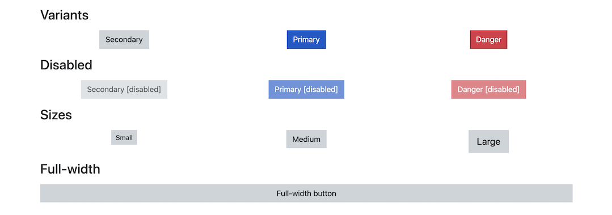
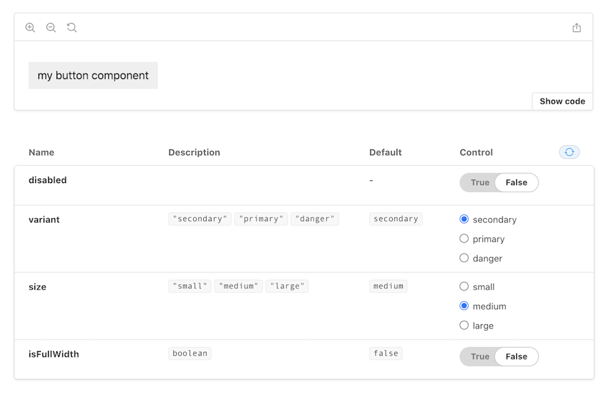

Now that we have a flexible API to control our `Button` component, let's add the relevant styling from our demo application. We will be using [styled-components](https://styled-components.com/) as our CSS-in-JS solution and including custom props for controlling each style.

## Prop definitions



Using the demo application we can identify four unique style combinations. These styles can be represented with the following props:

```txt
| Prop          | Values                                    | Default value             |
| ------------- | ----------------------------------------- | ------------------------- |
| `variant`     | `"secondary"`, `"primary"`, or `"danger"` | `"secondary"`             |
| `size`        | `"small"`, `"medium"`, or `"large"`       | `"medium"`                |
| `isFullWidth` | `true` or `false`                         | `false`                   |
| `disabled`    | `true` or `false`                         | inherited from `<button>` |
```

With these values we are able to create a custom prop interface for our `Button` component. Note that `disabled` is a native property already provided by `HTMLButtonElement` so we don't have to explicitly define it.

```tsx
// File: src/buttons/Button.tsx

export interface ButtonProps extends React.ComponentPropsWithoutRef<'button'> {
  variant?: "secondary" | "primary" | "danger";
  size?: "small" | "medium" | "large";
  isFullWidth?: boolean;
}

export const Button = React.forwardRef<HTMLButtonElement, ButtonProps>(
  ({ children, variant, size, isFullWidth, ...props }, ref) => {
  return (
    <button ref={ref} type="button" {...props}>
      {children}
    </button>
  );
});

Button.defaultProps = {
  variant: "secondary",
  size: "medium",
  isFullWidth: false,
};
```

## styled-components

Similar to `react` and `react-dom`, `styled-components` requires us to [mark it as a peer dependency](https://styled-components.com/docs/faqs#i-am-a-library-author-should-i-bundle-styledcomponents-with-my-library). We will also be including [polished](https://polished.js.org/); a library that allows us to perform style calculations at runtime.

```bash
# Install styled-components dependencies
npm install --save-peer styled-components
npm install --save-dev @types/styled-components

# Install polished for style calculations
npm install polished
```

### Global variables

Even though we are writing our styles with CSS-in-JS, many of the best practices from traditional CSS and pre-processors still apply. Our demo application provides color constants from the `_variables.scss` file for use throughout its components. Let's migrate those SASS variables to TypeScript for use in our components.

Create a new file at `src/utils/styles.ts`.

```bash
mkdir src/utils
```

```tsx
// File: src/utils/styles.ts

export const SECONDARY_COLOR = "#ced4da";
export const SECONDARY_TEXT_COLOR = "#000";
export const PRIMARY_COLOR = "#0a58ca";
export const PRIMARY_TEXT_COLOR = "#fff";
export const DANGER_COLOR = "#dc3545";
export const DANGER_TEXT_COLOR = "#fff";
export const DISABLED_OPACITY = 0.65;
```

### Initial styling

Create a new `styles.ts` file alongside `Button.tsx`. This file will include all of the styling logic for the component.

If we look at the `.company-button` styles from the demo application we can identify some initial styles that are provided regardless of the different style variants. Let's create a new styled component that includes these styles.

The styled component uses `styled.button` to ensure that we are styling the correct native element. We are also able to provide the `ButtonProps` interface as a type variable to type-check our style usage.

```ts
// File: src/buttons/styles.ts

import styled from "styled-components";
import { ButtonProps } from "./Button";
import { DISABLED_OPACITY } from '../utils/styles';

export const StyledButton = styled.button<ButtonProps>`
  cursor: pointer;
  display: inline-block;
  font-weight: 400;
  text-align: center;
  vertical-align: middle;
  user-select: none;
  border: 1px solid transparent;
  padding: 0.4rem 0.75rem;
  font-size: 1rem;
  line-height: 1.5;
  border-radius: 0;
  transition: all 0.15s ease-in-out;

  &:focus {
    outline: 0;
  }

  &:disabled {
    cursor: inherit;
    opacity: ${DISABLED_OPACITY};
  }
`;
```

The original styles from the demo styleguide `Buttons.scss` references the `$disabled-opacity` SASS variable. We can replace this value with the constant provided by `src/utils/styles.ts`.

Next, update the main `Button` component to return the `StyledButton` component along with the custom props defined earlier.

```tsx
// File: src/buttons/Button.tsx

import { StyledButton } from './styles.ts';

export const Button = React.forwardRef<
  HTMLButtonElement,
  ButtonProps & React.ComponentPropsWithoutRef<'button'>
>(({ children, variant, size, isFullWidth, ...props }, ref) => {
  return (
    <StyledButton
      ref={ref}
      type="button"
      variant={variant}
      size={size}
      isFullWidth={isFullWidth}
      {...props}
    >
      {children}
    </StyledButton>
  );
});
```

We aren't modifying styles based on these props yet, but you will be able to see them in Storybook at this time. To ensure that a `disabled` knob is available for testing, modify the story args to include a default value of `false`.

```tsx
// File: src/stories/Button.stories.tsx

export const Default = Template.bind({});

Default.args = {
  disabled: false,
};
```



### `isFullWidth` support

The first styled prop that we will implement is `isFullWidth`. If we look at the `.is-block` class defined in `Buttons.scss` we can see that it modifies two default CSS properties, `display` and `width`.

To dynamically modify these properties we can interpolate them within the styled components template literal. We are able to modify the default values whenever the `isFullWidth` prop is `true`.

```tsx
`
  display: ${(p) => (p.isFullWidth ? "block" : "inline-block")};
  width: ${(p) => p.isFullWidth && "100%"};
`;
```

Toggling the `isFullWidth` prop toggle in Storybook will now cause the component to expand.

### `size` support

The `size` prop can be implemented similarly to `isFullWidth`. We need to modify the `padding` and `font-size` properties based on the `size` value. Rather than use a nested ternary we can improve readability with standard conditionals.

```tsx
// File: src/buttons/styles.ts

`
  padding: ${(p) => {
    if (p.size === "large") {
      return "0.5rem 1rem";
    } else if (p.size === "small") {
      return "0.25rem 0.5rem";
    }

    return "0.4rem 0.75rem";
  }};
  font-size: ${(p) => {
    if (p.size === "large") {
      return "1.25rem";
    } else if (p.size === "small") {
      return "0.875rem";
    }

    return "1rem";
  }};
`;
```

### `variant` support

The `variant` prop is more complex than the previous styles. It modifies several CSS properties including the `:focus-visible` pseudo-selector. Instead of duplicating the color logic across several properties we will be creating a utility function to compute the correct styles.

This utility function will also use the polished [transparentize](https://polished.js.org/docs/#transparentize) method to compute the transparent focus ring value at runtime.

```ts
// File: src/buttons/styles.ts

import { transparentize } from 'polished';

const colorStyles = (p: ButtonProps) => {
  let color = SECONDARY_TEXT_COLOR,
    backgroundColor = SECONDARY_COLOR;

  if (p.variant === "primary") {
    color = PRIMARY_TEXT_COLOR;
    backgroundColor = PRIMARY_COLOR;
  } else if (p.variant === "danger") {
    color = DANGER_TEXT_COLOR;
    backgroundColor = DANGER_COLOR;
  }

  return css`
    color: ${color};
    background-color: ${backgroundColor};
    border-color: ${backgroundColor};

    &:focus-visible {
      border-color: ${color};
      box-shadow: 0 0 0 0.2rem ${transparentize(0.45, backgroundColor)};
    }
  `;
};

export const StyledButton = styled.button<ButtonProps>`
  /** Other styles */
  ${colorStyles}
`;
```

To return styling from a utility method we must use the [styled-component CSS utility](https://styled-components.com/docs/api#css).

## Commit changes

Now that all our styled component supports all of the custom props we can view all the combinations in Storybook.

Save our progress by creating a new commit.

```bash
git add -A
git commit -m "Add styled-components for Button"
```

## Next lesson

Next we will learn how to ensure prop-types are enforced for both TypeScript and JavaScript consumers.
