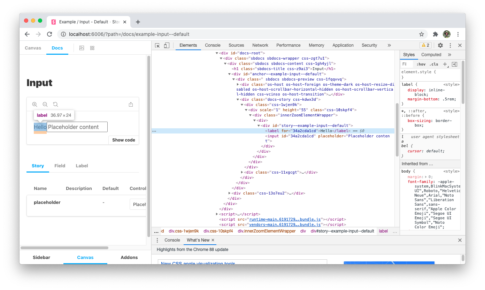
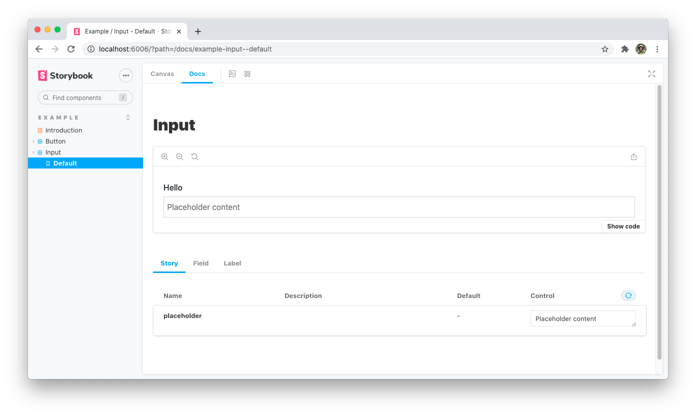

## Components

Our API for the `Field` will have two compound components, `Label` and `Input`.

```tsx
<Field>
  <Field.Label>Accessible label</Field.Label>
  <Field.Input placeholder="Placeholder content" />
</Field>
```

The `Field` component will provide a unique ID to `Field.Label` and `Field.Input` using the Context API.

### `useUniqueID` hook

To generate our unique IDs we will be creating a custom [React Hook](https://reactjs.org/docs/hooks-intro.html) using the [Nano ID](https://www.npmjs.com/package/nanoid) library. Nano ID is a powerful utility that is able to create URL-friendly unique strings. Let's add the library as a dependency:

```bash
npm install nanoid
```

Next, we need to create a new file for our hook. Since this utility can be useful for future component development we will place it in the utils folder.

```bash
touch src/utils/useUniqueID.ts
```

Our unique IDs aren't required to be cryptographically secure so we are able to use the more performant `non-secure` import of Nano ID. We will also be creating a `customAlphabet` implementation to create a consistent ID structure that still has enough uniqueness to avoid potential collisions.

```ts
// File: src/utils/useUniqueID.ts

import { useState } from 'react';
import { customAlphabet } from 'nanoid/non-secure';

const nanoid = customAlphabet('1234567890abcdef', 10);

export const useUniqueID = (): string => {
  const [id] = useState(nanoid());

  return id;
};
```

Our hook will generate a new ID when first rendered and return that same value throughout a consuming components lifecycle.

### `Field` Context provider

Our wrapping `Field` component will provide the value returned by `useUniqueID` through Context to its children. Create a new directory for the provider and its context:

```bash
mkdir src/fields
touch src/fields/Field.tsx
touch src/fields/FieldContext.tsx
```

Next, we can create a new `FieldContext` export that is typed to return a `string` (the unique ID) or `undefined`. This allows consumers to use the `Field.Label` and `Field.Input` components without a wrapper if necessary.

```ts
// File: src/fields/FieldContext.tsx

import { createContext } from 'react';

export const FieldContext = createContext<string | undefined>(undefined);
```

Our `Field` component will call the `useUniqueID` hook and provide that value to `FieldContext.Provider`.

```tsx
// File: src/fields/Field.tsx

import React from 'react';
import { useUniqueID } from '../utils/useUniqueID';
import { FieldContext } from './FieldContext';

export const Field: React.FC = ({ children }) => {
  const id = useUniqueID();

  return <FieldContext.Provider value={id}>{children}</FieldContext.Provider>;
};
```

### `Field.Label`

Our `Label` component is built using the same techniques that we learned in the previous module. We need to include: children pass-through, JSX prop-spreading, and the `forwardRef` API. Let's create the initial component:

```bash
touch src/fields/Label.tsx
```

```tsx
// File: src/fields/Label.tsx

import React, { useContext } from 'react';

export const Label = React.forwardRef<
  HTMLLabelElement,
  React.ComponentPropsWithoutRef<'label'>
>((props, ref) => {
  return <label ref={ref} {...props} />;
});

Label.displayName = 'Field.Label';
```

We are able to customize the `displayName` property to ensure that any errors reference the correct component name. Now we will retrieve the unique ID from `FieldContext` with the `useContext` hook. This value is applied to the `htmlFor` attribute.

```tsx
// File: src/fields/Label.tsx

import { FieldContext } from './FieldContext';

export const Label = React.forwardRef<...>((props, ref) => {
  const id = useContext(FieldContext); // returns undefined if not wrapped by a `Field`

  return <label ref={ref} htmlFor={id} {...props} />;
});
```

By applying the `hmtlFor` attribute _before_ we spread the `props` values we ensure than any customizations provided by consumers have priority.

### `Field.Input`

Similar to `Label` we will create an `Input` component that applies the value provided by `FieldContext` to the `id` attribute of the input. Let's create the new component:

```bash
touch src/fields/Input.tsx
```

```tsx
// File: src/fields/Input.tsx

import React, { useContext } from 'react';
import { FieldContext } from './FieldContext';

export const Input = React.forwardRef<
  HTMLInputElement,
  React.ComponentPropsWithoutRef<'input'>
>((props, ref) => {
  const id = useContext(FieldContext);

  return <input ref={ref} id={id} {...props} />;
});

Input.displayName = 'Field.Input';
```

## Compound components and TypeScript

With the `Label` and `Input` components built we need to export them as properties of the `Field` component. This can be tricky to type correctly with TypeScript, but we can accomplish this by creating a custom composition interface using the [`typeof` operator](https://www.typescriptlang.org/docs/handbook/2/typeof-types.html):

```tsx
// File: src/fields/Field.tsx

import { Label } from './Label';
import { Input } from './Input';

interface FieldComposition {
  Label: typeof Label;
  Input: typeof Input;
}

export const Field: React.FC & FieldComposition = ({ children }) => {
  /* ... */
};

Field.Label = Label;
Field.Input = Input;
```

## Storybook example

To see our new component in action we can create a new `Input.stories.tsx` file for Storybook.

```bash
touch src/stories/Input.stories.tsx
```

```tsx
// File: src/stories/Input.stories.tsx

import React from 'react';
import { Story, Meta } from '@storybook/react';
import { Field } from '../fields/Field';

export default {
  title: 'Example/Input',
  component: Field.Input,
  subcomponents: { Field, label: Field.Label },
} as Meta;

export const Default: Story = ({ placeholder }) => {
  return (
    <Field>
      <Field.Label>Hello</Field.Label>
      <Field.Input placeholder={placeholder} />
    </Field>
  );
};

Default.args = {
  placeholder: 'Placeholder content',
};
```

If you inspect the DOM of the example you will see our unique ID being applied to the label and input elements.



## Styling

Now that we have a working example of our components let's include the missing styling from our styleguide environment. Similar to `Button`, we will be creating a separate styling file.

```bash
touch src/fields/styles.ts
```

We will be creating two styled components, `StyledLabel` and `StyledInput`. These implementations will use the relevant style constants and polished utilities to match the styleguide.

```tsx
// File: src/fields/styles.ts

import styled from 'styled-components';
import { transparentize } from 'polished';
import {
  SECONDARY_COLOR,
  SECONDARY_TEXT_COLOR,
  PRIMARY_COLOR,
  DISABLED_OPACITY,
} from '../utils/styles';

export const StyledLabel = styled.label`
  font-weight: 500;
  margin-bottom: 0.4rem;
`;

export const StyledInput = styled.input`
  display: block;
  width: 100%;
  padding: 0.5rem 0.4rem;
  font-size: 1rem;
  line-height: 1.5;
  color: ${SECONDARY_TEXT_COLOR};
  background-color: transparent;
  border: 1px solid ${SECONDARY_COLOR};
  appearance: none;
  border-radius: 0;
  transition: all 0.15s ease-in-out;

  &:focus {
    outline: none;
    border-color: ${PRIMARY_COLOR};
    box-shadow: 0 0 0 0.2rem ${transparentize(0.75, PRIMARY_COLOR)};
  }

  &:disabled {
    background-color: ${SECONDARY_COLOR};
    opacity: ${DISABLED_OPACITY};
  }
`;
```

We then need to consume these styles in our components.

```tsx
// File: src/fields/Label.tsx

import { StyledLabel } from './styles';

return <StyledLabel ref={ref} htmlFor={id} {...props} />;
```

```tsx
// File: src/fields/Input.tsx

import { StyledInput } from './styles';

return <StyledInput ref={ref} id={id} {...props} />;
```



## Commit changes

Save our progress by creating a new commit.

```bash
git add -A
git commit -m "Add Field, Input, and Label components"
```

## Next lesson

In the nest lesson we will be exploring how to extend existing styled components by creating a new `Textarea` component.
