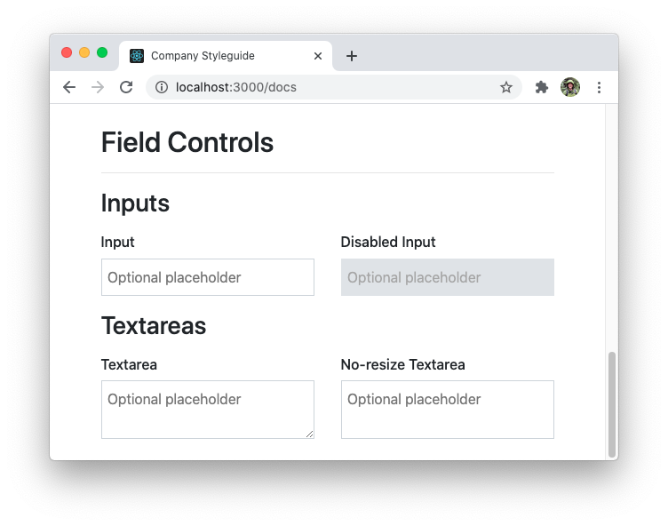
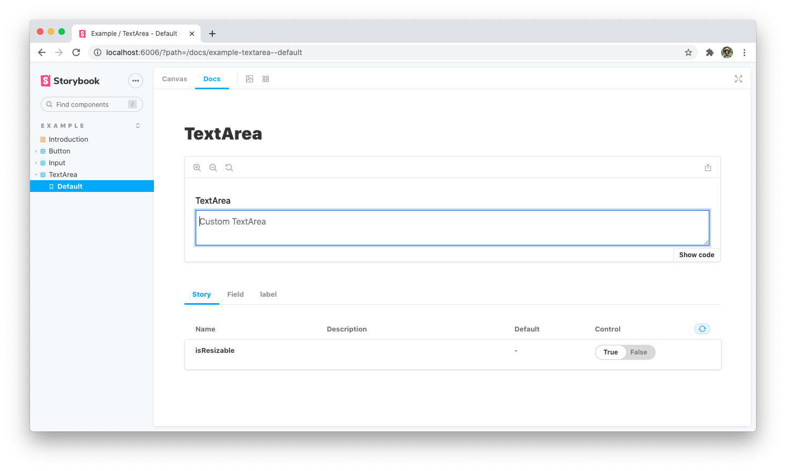

Within component libraries you often need to extend or modify the styles of an existing component. Styled-components and other CSS-in-JS libraries provide functionality for achieving this in a flexible way. In this lesson we will be creating a `Textarea` component that extends the styling of our existing `Input`.

## Extending existing styles

To start we will create a new styled element. To [extend styles in styled-components](https://styled-components.com/docs/basics#extending-styles) we can wrap our existing `StyledInput` element with a style declaration.

```tsx
// File: src/fields/styles.ts

export const StyledTextarea = styled(StyledInput)``;
```

This will extend the existing styles from our Input element. For the `Textarea` component we want to retain this styling, but change the underlying HTML element that is rendered from an `input` to a `textarea`. We can achieve this with the [`as` prop](https://styled-components.com/docs/api#as-polymorphic-prop).

```tsx
// File: src/fields/styles.ts

export const StyledTextarea = styled(StyledInput as 'textarea').attrs({
  as: 'textarea',
})``;
```

Using the `attrs()` and `as` utilities we are able to create a new styled element that retains the styling of an Input component while rendering a new `textarea` element.

### Creating the `Textarea` component

Now that we have a styled element we can create the shareable `Textarea` component. Let's create a new file:

```bash
touch src/fields/Textarea.tsx
```

The implementation of the `Textarea` mimics `Input` closely. The differences will be updating the TypeScript interfaces to reference `textarea`, updating the component `displayName`, and returning the new `StyledTextarea` element.

```tsx
// File: src/fields/Textarea.tsx

import React, { useContext } from 'react';
import { FieldContext } from './FieldContext';
import { StyledTextarea } from './styles';

export const Textarea = React.forwardRef<
  HTMLTextAreaElement, // New type for `ref` consumers
  React.ComponentPropsWithoutRef<'textarea'> // New component props
>((props, ref) => {
  const id = useContext(FieldContext);

  return <StyledTextarea ref={ref} id={id} {...props} />; // New styled element
});

Textarea.displayName = 'Field.Textarea'; // Updated display name
```

Next, we need to add `Textarea` as a compound component to `Field`.

```tsx
// File: src/fields/Field.tsx

import { Textarea } from './Textarea';


interface FieldComposition {
  ...
  Textarea: typeof Textarea;
}

Field.Textarea = Textarea;
```

### Documentation

With the `Textarea` now added we can create a new story for the component. Create a new file with the following content:

```bash
touch src/stories/Textarea.stories.tsx
```

```tsx
// File: src/stories/Textarea.stories.tsx

import React from 'react';
import { Story, Meta } from '@storybook/react';
import { Field } from '../fields/Field';

export default {
  title: 'Example/TextArea',
  component: Field.Textarea,
  subcomponents: { Field, label: Field.Label },
} as Meta;

const Template: Story = (args) => (
  <Field>
    <Field.Label>TextArea</Field.Label>
    <Field.Textarea placeholder="Custom TextArea" {...args} />
  </Field>
);

export const Default = Template.bind({});
```

You should now be able to view our `Textarea` component rendering correctly.

## Adding new style props

When extending existing styles, you will often need to add additional style props for the new component. From our demo styleguide, we can see the concept of a "non-resizable" textarea.



To allow this style option we will need to create a new `isResizable` style prop.

```tsx
// File: src/fields/Textarea.tsx

import React, { useContext } from 'react';
import PropTypes from 'prop-types';
import { FieldContext } from './FieldContext';
import { StyledTextarea } from './styles';

export interface TextareaProps
  extends React.ComponentPropsWithoutRef<'textarea'> {
  isResizable?: boolean;
}

export const Textarea = React.forwardRef<HTMLTextAreaElement, TextareaProps>(
  ({ isResizable, ...props }, ref) => {
    const id = useContext(FieldContext);

    return <StyledTextarea ref={ref} id={id} isResizable={isResizable} {...props} />;
  }
);

Textarea.displayName = 'Field.Textarea';

Textarea.defaultProps = {
  isResizable: true,
};

Textarea.propTypes = {
  isResizable: PropTypes.bool,
};
```

We start by creating a new `TextareaProps` interface. This defines the `isResizable` prop as an optional boolean. Apply the new prop to the `StyledTextarea` component. Next we will default `isResizable` to true using `defaultProps` and provide accurate Prop-type definitions.

Once `Textarea` is updated, we can add the matching style logic to `StyledTextarea`.

```tsx
// File: src/fields/styles.ts

import { TextareaProps } from './Textarea';


export const StyledTextarea = styled(StyledInput as 'textarea').attrs({
  as: 'textarea',
})<TextareaProps>`
  resize: ${(props) => !props.isResizable && 'none'};
`;
```

To view this prop in Storybook we can add a new argument to `Textarea.stories.tsx`.

```tsx
// File: src/stores/Textarea.stories.tsx

export const Default = Template.bind({});

Default.args = {
  isResizable: true,
};
```

We can now see the `isResizable` prop shown as a control knob in the Docs tab.



## Commit changes

Save our progress by creating a new commit.

```bash
git add -A
git commit -m "Add TextArea component"
```

## Next lesson

In the next module we'll learn how to test our components with React Testing Library.
