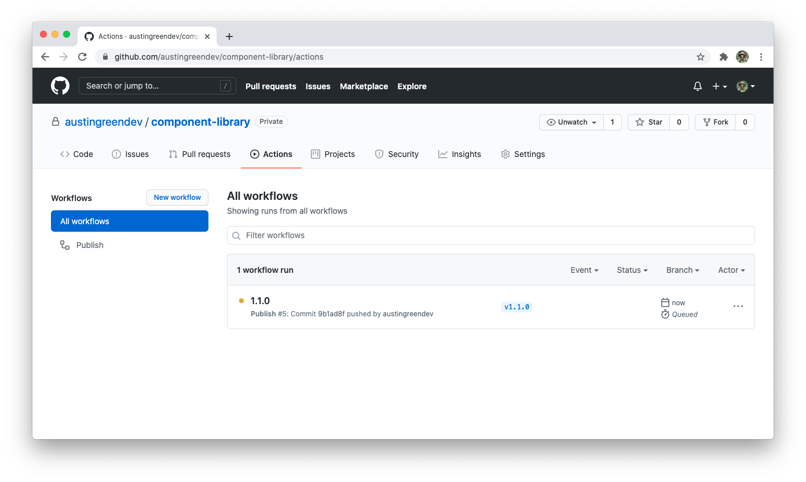
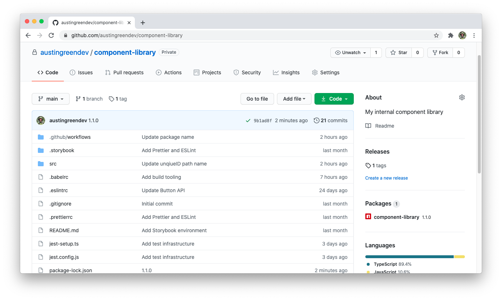
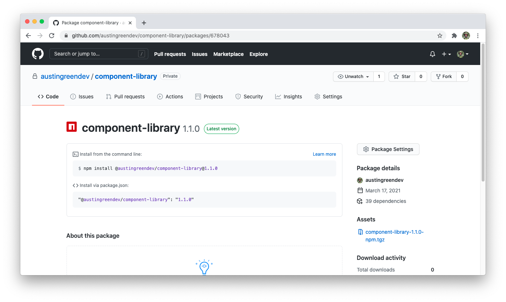

## Versioning

To publish our package we must tag a new version locally and push to our repo. This will trigger our GitHub Actions workflow which will complete the publish for us.

For this first release we will tag a new minor version, `v0.1.0`. By applying a `minor` version the package version number is automatically updated for us.

```bash
npm version minor
```

This will create a new commit along with a git tag representing the version. Push the commit and our new tag to the `master` branch:

```bash
git push --follow-tags
```

## Publish workflow

Once the tag is pushed, our `publish` workflow will start immediately. You can view running workflows in the `Actions` tab of your repository.



Once the workflow is complete you can see our newly published package in the sidebar of the repository. It will follow the naming scheme `@GITHUBUSERNAME/component-library`.




## Next lesson

In the final lesson we will show how to consume an NPM package from the private registry and integrate it into our demo styleguide.
