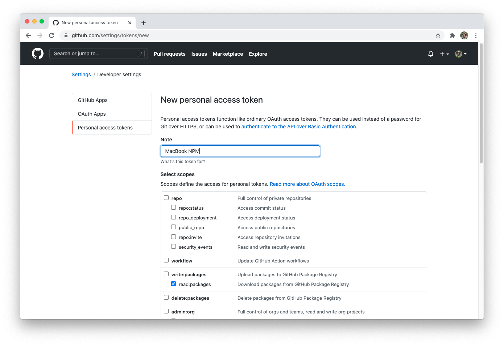

With our library now published to our internal package registry, we can consume our component library in another application. To test this functionality we will be replacing the demo elements within the `demo-styleguide` codebase.

Since our library isn't available in the public NPM registry we will need to [configure our local environment to authenticate with GitHub](https://docs.github.com/en/packages/guides/configuring-npm-for-use-with-github-packages).

## NPM configuration

Within the `demo-styleguide` codebase, add a new `.npmrc` file with the following content.

```bash
cd ./demo-styleguide
touch .npmrc
```

```txt
//npm.pkg.github.com/:_authToken=ACCESS_TOKEN
@GITHUBUSERNAME:registry=https://npm.pkg.github.com
```

**IMPORTANT:** Ensure that `@GITHUBUSERNAME` is updated to match your GitHub organization or account name. For my library this will be `@austingreendev`. This config ensures that any `@GITHUBUSERNAME/*` packages are retrieved with the GitHub registry while all others use the public NPM registry.

Once the configuration file is created we must create a new [Personal Access Token](https://github.com/settings/tokens/new) to authenticate with GitHub. This token should only contain the `read:packages` scope.



Once created, update `ACCESS_TOKEN` with this provided value. Ensure that `.npmrc` is added to your `.gitignore` so that our secret is not added to source control.

## Migrate demo components

With our `.npmrc` file created we can install our component library like any other package.

```bash
# Replace with your organization or username
npm install @GITHUBUSERNAME/component-library
```

Refactor the buttons example to use the `Button` component with the necessary style props:

```tsx
// File: src/components/Buttons.tsx

<div className="col-sm-4 text-center">
  <button className="company-button company-button--secondary">
    Secondary
  </button>
</div>
<div className="col-sm-4 text-center">
  <button className="company-button company-button--primary">
    Primary
  </button>
</div>
<div className="col-sm-4 text-center">
  <button className="company-button company-button--danger">
    Danger
  </button>
</div>
```

The `*--secondary` and `*--primary` classes are now represented with the `variant` prop.

```tsx
// File: src/components/Buttons.tsx

<div className="col-sm-4 text-center">
  <Button>Secondary</Button>
</div>
<div className="col-sm-4 text-center">
  <Button variant="primary">Primary</Button>
</div>
<div className="col-sm-4 text-center">
  <Button variant="danger">Danger</Button>
</div>
```

The `Field` component can replace the `label/input` examples:

```tsx
// File: src/components/FieldControls.tsx

<label htmlFor="my-input" className="company-label">
  Input
</label>
<input
  id="my-input"
  className="company-input"
  placeholder="Optional placeholder"
/>
```

```tsx
// File: src/components/FieldControls.tsx

<Field>
  <Field.Label>Input</Field.Label>
  <Field.Input placeholder="Optional placeholder" />
</Field>
```

We now have a shared component library that allows us to match all of the required features shown in the demo styleguide. Congratulations!

## Next steps

Now that you have a working component library, you can modify the styles and props provided by our components to match your own requirements. As you add new components and patterns remember to:

- Allow children pass-through when possible
- Use the `React.forwardRef` API to allow for advanced use cases
- Use JSX prop-spreading to avoid bloated prop-sheets
- Provide opinionated prop values when necessary
- Share state with `React.Context` and compound components

Thank you for using this course and good luck with your next component!
